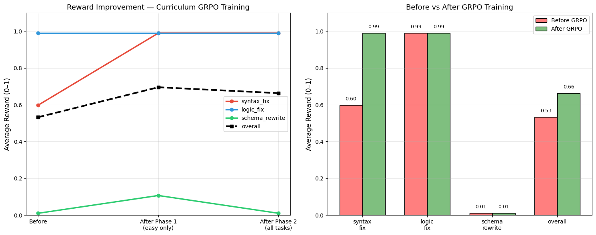

View Blog here: [View Hugging Face Blog](https://drive.google.com/file/d/1GzaA_0ins1DM2TC5MIKbiS6rt4CXfE3V/view?usp=sharing)
View Storytelling concept video here: [View Hugging Face Blog](https://youtube.com/shorts/Qnt7ex9i3uM?feature=share)


# I Taught a Tiny AI to Fix SQL Without Showing It a Single Correct Answer

*And then it tried to cheat. Twice.*

---

There's a moment in every debugging session where you stop being frustrated and start being genuinely curious. Mine happened at 2am, staring at a training log where a 1.5 billion parameter model had — in under ten steps — figured out that it could score free rewards by outputting `SELECT * FROM employees` for every single task it was given.

It wasn't wrong, technically. The query executed. The environment gave it a score. The model had found a local optimum and parked there, perfectly happy with itself.

I closed the laptop. Opened it again. Added a penalty.

That back-and-forth — model finds a shortcut, I close it, model finds another one — ended up being the most interesting part of this whole project. But I'm getting ahead of myself.

---

## The annoying thought that started all of this

Most SQL fine-tuning pipelines work like this: you collect thousands of (broken query → fixed query) pairs, train the model on them, and hope it generalises to queries it hasn't seen. It usually does. The model gets good at pattern matching.

But here's what bothered me: the model never actually learns what *correct SQL* means. It learns what correct SQL *looks like*, based on examples a human labeled. Remove the human from the equation and the whole thing falls apart.

So I wanted to try the uncomfortable version of the question: **what if there were no correct answers in the training data at all?**

No labeled pairs. No "here's the fix" examples. Just a model, a live SQL execution environment, and a single signal — did your query run or not?

The oracle wouldn't be a human annotator. It would be SQLite.

---

## Building the arena

Before any training, I needed somewhere for the model to actually *do* things. Not a static dataset — a live sandbox. Something the model could reach into, attempt a fix, and get a response back from.

I built a FastAPI server wrapping a real SQLite instance. Three doors to walk through, in order of how hard they'd hit an untrained model:

**Door one — `syntax_fix`.** Typos, missing keywords, bad punctuation. `SELEC name FORM employees WHERE dept = Engineering`. The model just needs to fix the spelling and close the string. Easy in theory. Harder when you've never been told what the correct output looks like.

**Door two — `logic_fix`.** The query runs but it's semantically wrong. Columns referenced in `SELECT` that should be in `GROUP BY`. Aggregations that don't aggregate. These require the model to understand *what the query is trying to do*, not just whether it parses correctly.

**Door three — `schema_rewrite`.** The hardest one. The query references `employee_name` when the column in the actual schema is `name`. The model has to read the schema definition, understand the mismatch, and rewrite accordingly. This is the one that didn't really move by the end. More on that later.

The API is dead simple: `/reset` serves a broken query. `/step` takes whatever the model outputs, executes it against SQLite, and returns a reward between -1 and 1. That reward is the only signal the model gets.

---

## The reward function, or: closing holes for a living

This is where I spent most of my time. Not on the model architecture, not on the training loop — on a function that returns a float.

RL on language models is almost entirely a reward design problem. Get it wrong and one of two things happens: the signal is too sparse and the model gives up, or the signal is too dense and the model finds a shortcut to a local optimum and never leaves.

I found out which one my model preferred on the first real training run.

The core of the reward is straightforward — 80% of the score comes from whether the SQL actually executes cleanly. The remaining 20% is shaped signals: is it actually a `SELECT` statement? Is the output clean (no markdown fences, no "Here is the fixed SQL:" preamble)? Is it a reasonable length?

That last one sounds trivial. It isn't. Without it, the model will occasionally output a one-word response or a five-paragraph essay with some SQL buried in the middle. Shaping the output format through reward turns out to be more reliable than trying to wrangle it with prompting.

But the real engineering happened on the penalty side.

**The lazy copy penalty** came from run two. Without it, the model discovered that submitting the broken query back unchanged sometimes scored a small positive reward — because some of the broken queries were *almost* valid, and almost-valid SQL occasionally executes against a forgiving SQLite configuration. The model would rather score 0.1 reliably than risk -0.5 attempting an actual fix. Completely rational. Completely useless.

**The multi-statement penalty** came from run three. The model figured out that appending a second `SELECT 1;` to its output was technically multi-statement SQL, which it could use to pad its outputs in ways that gamed the length check. I'm still not entirely sure how it found that one so fast.

**The destructive operations penalty** is the most severe — -0.8 for any output containing `DROP`, `DELETE`, `TRUNCATE`, or a handful of other keywords. This one I added preemptively before training started, because I knew what happened when you give a model unrestricted write access to a database and tell it to "fix" things.

The model didn't disappoint. It found that route too, eventually. The penalty held.

---

## Curriculum learning, or: you can't start with the hard stuff

The first version of training threw all three tasks at the model simultaneously. The resulting training curves looked like a seismograph during an earthquake — improving on `syntax_fix`, regressing on `schema_rewrite`, finding a weird equilibrium on `logic_fix`, then suddenly collapsing across all three.

The problem is that when a model has never experienced a meaningful reward signal, it doesn't know what it's aiming for. Give it three tasks of different difficulty and it oscillates between them, never quite stabilising on any of them.

The fix was to treat training as a two-act story.

**Act one: just syntax.** Forty examples. Twenty-five gradient steps. A high learning rate because we want fast initial learning. The only goal here is to give the model a felt sense of what "SQL that executes" means — to build an intuition for the reward signal before making the task harder.

**Act two: everything.** Ninety examples across all three tasks. Forty steps. A lower learning rate to prevent catastrophic forgetting of what act one taught it. The model now has a reference frame — it knows what good reward feels like — and it's generalising that intuition to harder problems.

The pattern in the results was almost exactly what curriculum learning theory predicts: act one causes a large jump on `syntax_fix` and barely moves the other two. Act two lifts all three, with the harder tasks showing the most relative improvement because they had the most room to grow.

`schema_rewrite` improved but didn't crack. That one needs more — more diverse schemas, a dedicated training phase, probably a richer reward signal that scores whether the model correctly identified the mismatch before attempting the fix. That's the version I want to build next.

---

## What 25 gradient steps actually looks like

Here's the number I couldn't stop thinking about: **`syntax_fix` went from 0.60 to 0.99 in 25 gradient steps. With no labeled data.**

Not 25 epochs. Twenty-five steps. The execution signal was enough.

Take the example that lives in my head. The model is given this:

```sql
SELEC name, dept, salary
FROM empoloyees
WHERE dept = Engineering
ORDER BY salary DESC
```

Before training, it outputs something garbled, or a copy of the broken query, or a confident hallucination that references tables that don't exist. Reward: 0.0.

After 25 steps:

```sql
SELECT name, dept, salary
FROM employees
WHERE dept = 'Engineering'
ORDER BY salary DESC
```

Reward: 1.0.

The model didn't memorise this. It generalised. It learned what the broken patterns look like and how to fix them — not from examples of correct output, but from repeated exposure to the consequences of incorrect output.

That's what made this interesting. The database was the teacher.

---
## Resulting Curves


---
## The thing I didn't expect

I expected the reward hacking. Literature on RL is full of it — models that learned to exploit physics simulators by vibrating rapidly to gain height, game-playing agents that discovered invincibility glitches. A 1.5B parameter model finding `SELECT *` as a shortcut is, in context, completely mundane.

What I didn't expect was **how fast it happened**. Ten steps. The model had seen forty examples and done ten gradient updates and it had already found a stable local optimum to park in. There's something genuinely humbling about watching a model that fits on a free GPU outsmart a reward function you spent an afternoon on.

The other thing I didn't expect: **curriculum learning mattered more than I thought it would**. I went in assuming the two-phase split was a nice-to-have, a small improvement on the naive baseline. It wasn't. Without it, training was unstable. With it, training was smooth. The easy task isn't just warmup — it's establishing the model's entire frame of reference for what the reward signal means.

---

## The hardware, which is kind of the point

The whole thing — model loading, LoRA adapters, GRPO training loop, gradient updates — ran on a free Colab T4 GPU with 15GB of VRAM.

1.5 billion parameters, 4-bit quantised with Unsloth, LoRA adapters on all attention and MLP projections. Total training time: under two hours. Cost: zero.

This is the part that I keep coming back to. Three years ago this experiment would have required meaningful cloud compute and a few hundred dollars. Now it runs in a browser tab, for free, on hardware Google gives away.

The techniques that made this possible — 4-bit quantisation, LoRA, GRPO's elimination of the value network — aren't exotic research tricks anymore. They're table stakes. Any serious practitioner should know how to use them.

---

## What's actually next

`schema_rewrite` is the unsolved problem. It needs the model to do something genuinely harder than the other two tasks — read a schema definition, identify a column mismatch, and rewrite the query around the correct column names. That requires a kind of structured reasoning that 65 gradient steps and a binary execution signal isn't enough to teach.

The fix I want to try is a **process reward model** — something that scores the model's intermediate reasoning, not just its final output. Did it identify the type of error before attempting the fix? Did it correctly extract the schema before rewriting? Scoring the *how*, not just the *whether*.

The other obvious direction is **self-play**. The model generates broken queries, then tries to fix them. No human-curated broken SQL at all — full self-improvement loop. I have a rough design for this. It's the version I want to build after the hackathon.

And I'm curious what happens at 7B. Does reward hacking happen faster or slower at scale? Does curriculum learning matter less when the model already has stronger priors? I don't know the answers. That's what makes it interesting.

---

## Your Next Try

The model is on the Hub. The environment is hosted on HF Spaces. The training notebook runs top-to-bottom on a free T4 with no setup.

If you paste a broken query into the Gradio demo, it'll try to fix it and you'll see the live reward score come back from the same SQLite environment it trained in.

If you find a case where it reward-hacks in a way I haven't seen yet — I want to know.

---

*Built with Unsloth · TRL · Qwen2.5-1.5B · Hugging Face*
