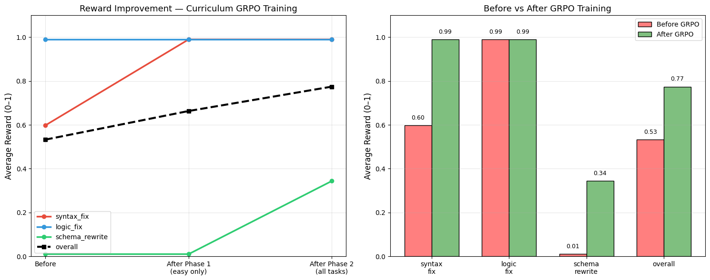
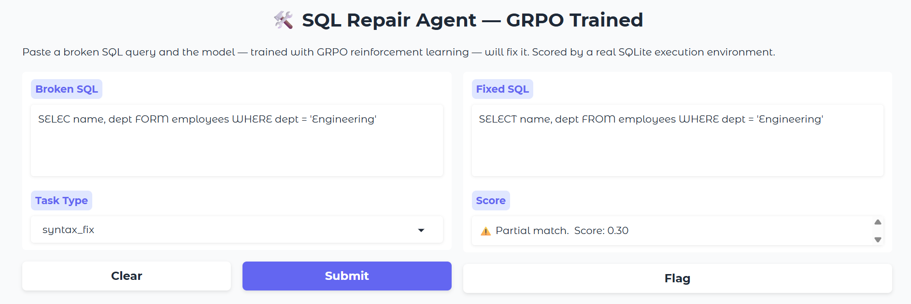
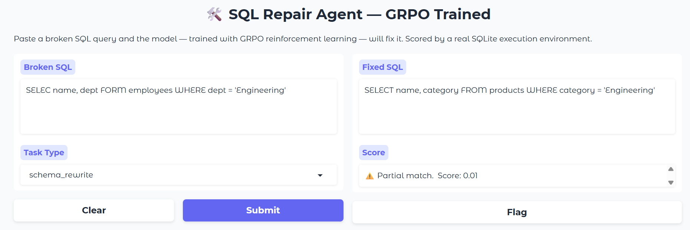
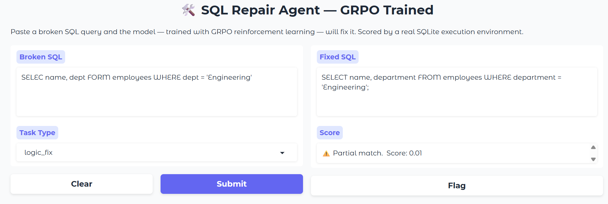

<div align="center">

```
███████╗ ██████╗ ██╗      ███████╗███████╗███╗   ██╗███████╗███████╗██╗
██╔════╝██╔═══██╗██║      ██╔════╝██╔════╝████╗  ██║██╔════╝██╔════╝██║
███████╗██║   ██║██║█████╗███████╗█████╗  ██╔██╗ ██║███████╗█████╗  ██║
╚════██║██║▄▄ ██║██║╚════╝╚════██║██╔══╝  ██║╚██╗██║╚════██║██╔══╝  ██║
███████║╚██████╔╝███████╗ ███████║███████╗██║ ╚████║███████║███████╗██║
╚══════╝ ╚══▀▀═╝ ╚══════╝ ╚══════╝╚══════╝╚═╝  ╚═══╝╚══════╝╚══════╝╚═╝
```

**A 1.5B model that learned to fix broken SQL without ever seeing a correct answer.**

*No labeled pairs. No supervised examples. Just a database, a reward signal, and stubbornness.*

[](https://colab.research.google.com/drive/1decl9L8u0pZrorSwu-D7PvubyqJ2pzcC?usp=sharing)
[](https://drive.google.com/file/d/1GzaA_0ins1DM2TC5MIKbiS6rt4CXfE3V/view?usp=sharing)
[](https://huggingface.co/spaces/A9Rawat/sql-repair-env)
[](https://huggingface.co/A9Rawat/sql-repair-grpo)
[](LICENSE)
[-orange)](https://colab.research.google.com)

</div>

---

## The idea in one sentence

> The model sees a broken query. It tries to fix it. A SQLite database tells it whether the fix actually runs. GRPO updates the weights. Repeat until good.

No teacher. No answers in the back of the book. Just trial, error, and a reward signal.

---

## Why this is interesting

Most SQL fine-tuning looks like this:

```
broken query → [human labels correct fix] → (broken, correct) pairs → supervised training
```

That works. But you're still bottlenecked by human labeling, and the model is memorizing patterns rather than learning what *correct SQL* actually means.

This project removes the human from that loop entirely:

```
broken query → model attempts fix → SQLite executes it → reward: did it run? → GRPO update
```

The model learns what correct SQL means from the database itself. The oracle is the execution engine, not a human annotator.

When I ran this, the model went from **0.60 → 0.99 on syntax repair** in 25 gradient steps with zero labeled examples. That's the result I didn't expect and couldn't stop thinking about.

---

## Results

| Task | Before | After Phase 1 | After Phase 2 | Δ |
|---|---|---|---|---|
| `syntax_fix` | 0.598 | **0.99** | **0.99** | **+0.39** |
| `logic_fix` | 0.99 | 0.99 | 0.99 | +0.00 |
| `schema_rewrite` | 0.01 | 0.01 | 0.3.44 | **+0.334** |
| **overall** | 0.533 | 0.663 | 0.775 | **+0.242** |

`logic_fix` was already near-ceiling — the base model handles semantic fixes reasonably well out of the box. `schema_rewrite` is the unsolved problem (see [What's next](#whats-next)).

The `syntax_fix` number is the one worth paying attention to. **0.60 → 0.99 with no labeled data in 25 steps.** The execution signal is enough.

<div align="center">
  
  <p><em>Reward curve across 65 gradient steps (Phase 1: syntax only → Phase 2: all tasks)</em></p>
</div>
---

## Live environment

The environment is a FastAPI server wrapping a real SQLite instance, hosted on HF Spaces. It's OpenEnv-compliant and publicly accessible — no auth, no setup.

```
https://A9Rawat-sql-sensei.hf.space
```

```bash
# Is it alive?
curl https://A9Rawat-sql-sensei.hf.space/health

# Start an episode — get a broken query
curl -X POST https://A9Rawat-sql-sensei.hf.space/reset \
  -H "Content-Type: application/json" \
  -d '{"task_name": "syntax_fix"}'

# Submit your fix — get a reward
curl -X POST https://A9Rawat-sql-sensei.hf.space/step \
  -H "Content-Type: application/json" \
  -d '{"sql": "SELECT name FROM employees WHERE dept = '\''Engineering'\'''}"'
```

Or use the Python client:

```python
pip install git+https://huggingface.co/spaces/A9Rawat/sql-sensei
```

```python
from sql_sensei_env import SQLSenseiEnv, SQLAction

env = SQLSenseiEnv(base_url="https://A9Rawat-sql-sensei.hf.space")

obs = env.reset(task_name="syntax_fix")
print(obs.broken_sql)        # SELEC name FORM employees WHERE dept = Engineering
print(obs.task_description)  # Fix the syntax errors in the following SQL query.

result = env.step(SQLAction(sql="SELECT name FROM employees WHERE dept = 'Engineering'"))
print(result.reward)         # 1.0
```

### Three tasks, increasing difficulty

| Task | What's broken | Example |
|---|---|---|
| `syntax_fix` | Typos, missing keywords, bad punctuation | `SELEC name FORM employees` |
| `logic_fix` | Wrong joins, bad aggregations, `GROUP BY` violations | Non-aggregated columns in `SELECT` with `GROUP BY` |
| `schema_rewrite` | Query references columns/tables that don't exist | `employee_name` when the column is `name` |

---

## The reward function

This is where most of the work actually happened. RL on LLMs lives and dies by reward design — signal too sparse and the model gives up, too dense and it finds shortcuts that aren't what you wanted.

```python
def reward_fn(completions, prompts=None, **kwargs):
    rewards = []
    for sql_raw, task_name in zip(completions, task_names):
        sql = extract_sql(sql_raw)
        score = 0.0

        # 80% of the signal: did it actually run?
        env_reset(task_name)
        result = env_step(sql)
        score += float(result.get('reward', 0.0)) * 0.8

        # Bonus: is it actually a SELECT (not a mutation)?
        if parsed[0].get_type() in ('SELECT', 'WITH'):
            score += 0.1

        # Bonus: clean output — no markdown fences, no preamble
        if '```' not in sql and not sql.lower().startswith('here'):
            score += 0.05

        # Bonus: sane length (4–100 words)
        if 4 < word_count < 100:
            score += 0.05

        # Hard penalties
        if any(b in sql.lower() for b in banned_keywords):
            score -= 0.8   # DROP, DELETE, TRUNCATE — no

        if sql.strip() == broken_sql.strip():
            score -= 0.5   # just copying the broken input back

        if sql.count(';') > 1 or '\n\n' in sql:
            score -= 0.2   # multi-statement or explanation appended

        rewards.append(max(min(score, 1.0), -1.0))
    return rewards
```

**The anti-hack penalties are real.** Within the first 10 training steps of an early run, the model discovered that `SELECT * FROM employees` scored a partial reward on every task because it executed without error. Reward hacking, in a 1.5B parameter model, in 10 steps. The lazy-copy penalty and multi-statement penalty came directly from watching the model find shortcuts and closing them.

---

## Training — two-phase curriculum

Throwing all three tasks at an untrained model simultaneously doesn't work. The model improves on syntax, regresses on logic, oscillates, and never stabilises.

The fix is curriculum learning: start where the model can actually win, then raise the bar.

**Phase 1 — Syntax only**
```
40 examples · 25 gradient steps · LR 2e-5
Goal: teach the model what "SQL that executes" feels like
```

**Phase 2 — All tasks**
```
90 examples (30 per task) · 40 gradient steps · LR 8e-6
Goal: generalise without forgetting Phase 1
```

Total: **65 gradient steps** on a **free T4 GPU**. The whole training run takes under 2 hours.

---

## Repo structure

```
sql-sensei/
│
├── server/
│   ├── app.py            ← FastAPI: /reset, /step, /state, /health
│   ├── environment.py    ← task logic + SQLite execution engine
│   └── requirements.txt
│
├── training/
│   └── colab_training.ipynb   ← full GRPO notebook, runs top-to-bottom
│
├── results/
│   ├── reward_curve.png       ← training progress
│   └── eval_results.json      ← raw eval numbers
│
├── models.py       ← Action / Observation dataclasses
├── client.py       ← SQLSenseiEnv HTTP client
├── openenv.yaml    ← OpenEnv manifest
├── Dockerfile      ← HF Spaces container
└── README.md
```

---

## Run it yourself

### Hosted (zero setup)

```python
from sql_sensei_env import SQLSenseiEnv, SQLAction

env = SQLSenseiEnv(base_url="https://A9Rawat-sql-sensei.hf.space")
obs = env.reset(task_name="syntax_fix")
result = env.step(SQLAction(sql="SELECT name FROM employees WHERE dept = 'Engineering'"))
print(result.reward)  # 1.0
```

### Local server

```bash
git clone https://huggingface.co/spaces/A9Rawat/sql-sensei
cd sql-sensei
pip install -r server/requirements.txt
uvicorn server.app:app --host 0.0.0.0 --port 7860
curl http://localhost:7860/health
```

### Docker

```bash
docker pull registry.hf.space/a9rawat-sql-sensei:latest
docker run -d -p 7860:7860 registry.hf.space/a9rawat-sql-sensei:latest
```

### Train from scratch

The training notebook lives at `training/colab_training.ipynb` in this repo. You can also open it directly in Colab — it's fully self-contained and runs top to bottom with no local setup needed.

[](https://colab.research.google.com/drive/1decl9L8u0pZrorSwu-D7PvubyqJ2pzcC?usp=sharing)

> **Note:** Make sure you're on a T4 GPU runtime (Runtime → Change runtime type → T4 GPU) before running. The notebook installs all dependencies in the first cell.

**Requirements:** Google account (free), HF account (free), ~2 hours of T4 runtime.

---

## Use the trained model

```python
from unsloth import FastLanguageModel

model, tokenizer = FastLanguageModel.from_pretrained(
    model_name="A9Rawat/sql-sensei-model",
    max_seq_length=2048,
    load_in_4bit=True,
)
FastLanguageModel.for_inference(model)
```
## UI Design






---

## Tech stack

| Thing | What |
|---|---|
| Base model | Qwen2.5-1.5B-Instruct |
| Fine-tuning | LoRA (rank 16, alpha 16) |
| Training algorithm | GRPO |
| Quantisation | 4-bit via Unsloth |
| Hardware | Colab T4, free tier |
| Framework | HF TRL + Unsloth |
| Environment | OpenEnv (FastAPI + SQLite) |
| Training steps | 65 total (25 + 40) |
| Training examples | 180 (60 per task) |

---

## What's next

**`schema_rewrite` barely moved.** This is the genuinely hard task — the model needs to understand what columns actually exist in the schema and map unfamiliar names to the correct ones. 40 examples and 65 steps aren't enough. A dedicated third training phase with more diverse schemas is the obvious next move.

**Richer reward signal.** Right now it's mostly binary — did it execute or not. A process reward that scores intermediate reasoning (did the model correctly identify the error type before attempting the fix?) would make the training signal much denser and probably fix `schema_rewrite`.

**Self-play loop.** The model generates broken queries, then tries to fix them. No human-curated broken SQL at all — full self-improvement. That's the version I want to build next.

---

## Links

- 📖 [Blog post](https://drive.google.com/file/d/1GzaA_0ins1DM2TC5MIKbiS6rt4CXfE3V/view?usp=sharing) 
- 🎮 [Live demo on HF Spaces](https://huggingface.co/spaces/A9Rawat/sql-repair-env) 
- 🎥 [Video walkthrough](https://youtube.com/YOUR_LINK) 

---
## Live Gradio Link
https://2dacbe00d3ada0df92.gradio.live/

## HF Blog

The write-up is a markdown article located at `blog/HFBlog.md` in this repo.

---


---

<div align="center">

Apache 2.0 — use it, fork it, train weirder things with it.

*Built by [@A9Rawat](https://huggingface.co/A9Rawat)*

</div>
